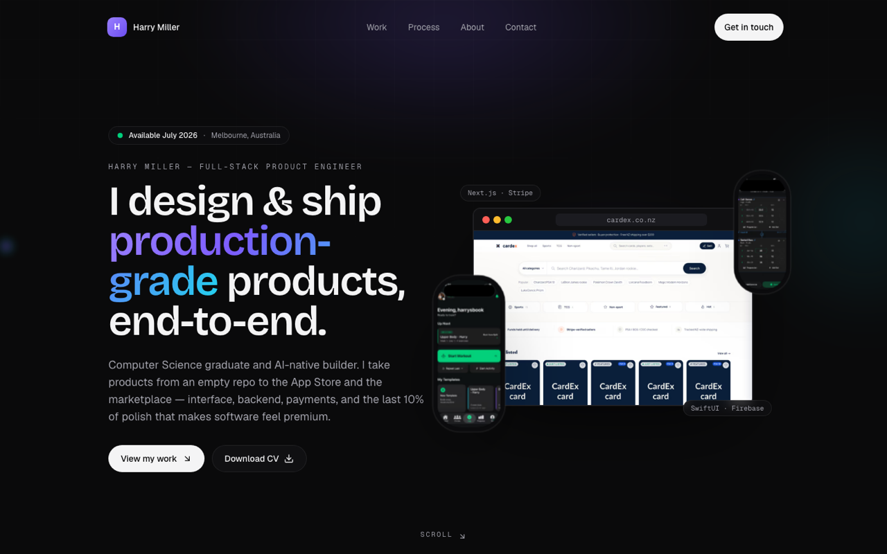

# Harry Miller — Portfolio

> The source for my personal portfolio. A motion-led, dark, production-grade site built to show — not just tell — that I design and ship products end-to-end.

**Live:** _deploying soon_ · **Stack:** Next.js 16 · TypeScript · Tailwind CSS · Framer Motion · Lenis



## What this is

A single-page portfolio with a signature **3D product gallery** hero, three in-depth case studies, and an "how I build" section — engineered to the same bar as the products it showcases. Every animation is buttery, every breakpoint is clean, and the whole thing is accessible and fast.

## Highlights

**Design & motion**
- A cohesive **"Midnight Kinetic"** design system (tokens for colour, type, spacing, radius, motion) in `tailwind.config.ts` + `app/globals.css`.
- **Live 3D product gallery** — real app screenshots floating in a perspective scene with pointer-driven tilt + parallax and scroll-scrubbed depth.
- Custom **cursor spotlight**, **magnetic** CTAs, **Lenis** smooth scroll, scroll-reveal and count-up primitives — all composed from small, reusable components.
- Per-project accent system so each case study has its own identity (viridian / orange / electric blue).

**Engineering & quality**
- **Flawless responsive** layout (375 → 1440px) with zero horizontal overflow at any width.
- **Accessible:** WCAG AA contrast, visible keyboard focus, skip-link, semantic headings, alt text on every image, ARIA-labelled landmarks, 44px touch targets.
- **Reduced-motion aware** — every effect has a static fallback via `prefers-reduced-motion`.
- **Performance:** `next/image` with AVIF/WebP + tight `sizes`, lazy-loaded below-fold media, no render-blocking animation libs.
- **SEO:** generated Open Graph image (`app/opengraph-image.tsx`), JSON-LD `Person` schema, full metadata.

## Tech stack

| Area | Choice |
|------|--------|
| Framework | Next.js 16 (App Router) |
| Language | TypeScript (strict) |
| Styling | Tailwind CSS v3 + a custom token layer |
| Motion | Framer Motion + Lenis (smooth scroll) |
| Icons | Lucide + Simple Icons brand glyphs |
| Deploy | Vercel |

## Featured work

- **The Card Exchange** — a production full-stack NZ trading-card marketplace (Next.js + Supabase + Stripe Connect, RLS, 200+ tests).
- **Logbook** — a premium SwiftUI + Firebase social fitness app with real-time chat and a coach layer.
- **Switchboard** — a live AI receptionist (Astro + Retell AI + Twilio) you can call right now.

## Project structure

```
app/                 # App Router entry, layout, OG image
components/
  sections/          # hero, proof, work, process, about, contact
  ui/                # reveal, marquee, count-up, button, section, cursor…
  device/            # iPhone + browser device frames
lib/content.ts       # single source of truth for all copy + project data
```

All site content lives in `lib/content.ts`, so the whole site is data-driven and easy to update.

## Getting started

```bash
npm install
npm run dev      # http://localhost:3000
npm run build    # production build
npm run lint     # eslint
```

## License

[MIT](LICENSE) © 2026 Harry Miller
